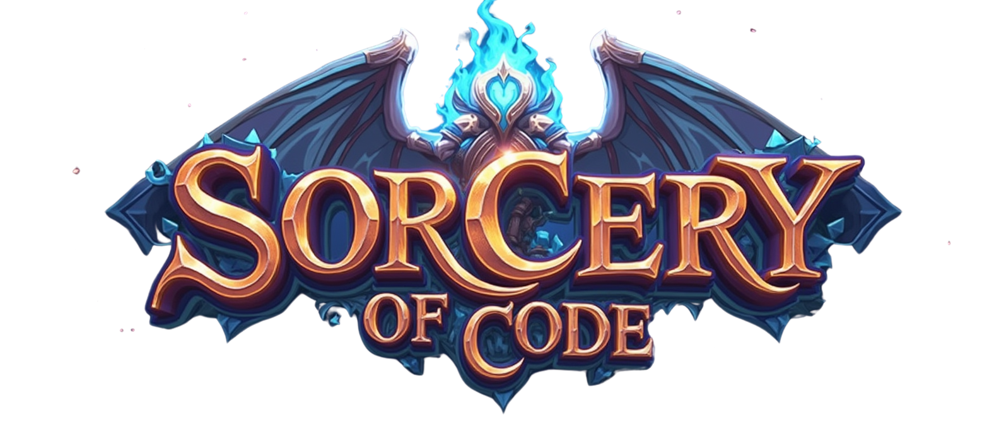

# Sorcery of Code

Learn Python, machine learning, and AI through hands-on coding challenges.

## About This Project

This project helps you learn to code through challenges that get harder as you progress!

Complete each task to unlock new lessons. Track your progress with badges and leaderboards.

## GitHub Skills You'll Develop

As you work through this project, you'll develop essential GitHub skills including:

- **Version Control**: Track changes in your code and collaborate with others
- **Pull Requests**: Submit your solutions and receive automated feedback
- **CI/CD**: Experience GitHub Actions that automatically test your code
- **Project Management**: Use GitHub issues and projects to track your progress
- **Documentation**: Learn to write effective README files and comments
- **Branch Strategy**: Practice Git branching for different features and solutions

## What You'll Learn

- **Module 0:** Python basics
- **Module 1:** Better Python skills and best practices
- **Module 2:** Machine learning fundamentals
- **Module 3:** Building AI applications
- **Module 4:** Final project to show what you've learned

## How to Start

1. **Fork this repository**: Click the "Fork" button in the top right of this repository
2. **Clone your fork**: `git clone https://github.com/YOUR-USERNAME/Sorcery-of-Code.git`
3. **Start with Module 0**: Navigate to the first lesson in the module-0-beginner-review folder
4. **Create a branch for your solution**: `git checkout -b your-username/module-0/lesson-1`
5. **Complete the challenge**: Edit the solution file according to instructions
6. **Commit your changes**: `git commit -m "Completed Module 0 Lesson 1"`
7. **Push to GitHub**: `git push origin your-username/module-0/lesson-1`
8. **Submit a pull request**: Compare your branch to the main repository

### GitHub Best Practices

- **Meaningful commit messages**: Write clear commit messages that explain what you did
- **Regular commits**: Make small, focused commits rather than one large commit
- **Keep branches updated**: Regularly sync your fork with the main repository
- **Code reviews**: Review the automated feedback on your pull requests
- **Documentation**: Update your README files with explanations of your solutions

### How Solutions Are Approved

When you submit a pull request with your solution:
- Automated tests run through GitHub Actions
- The system checks if your code passes all test cases
- No human review needed – it's all automated!
- If tests pass, you automatically receive a key to unlock the next lesson
- The leaderboard updates with your progress

## Leaderboard

View your progress and see how you compare with other students on the leaderboard:

- **Local view**: Open `docs/leaderboard.html` in your browser to see your personal progress
- **Online view**: Visit our [central leaderboard](https://short-circuits-hi.github.io/Sorcery-of-Code/leaderboard.html) to see everyone's progress

The leaderboard shows:
- Completed lessons
- Earned badges
- Recent activity

For more information about the leaderboard, check the [leaderboard documentation](docs/README.md).

### Branch Structure

This repository uses a multi-branch strategy:

- **`main`**: Stable, production-ready content
- **`develop`**: Latest approved content before merging to main
- **`module/X`**: Development branches for each module (X = module number)
- **`fix/description`**: Branches for bug fixes and improvements

**For Students:**
- Fork the repository
- Create your solution branch: `username/module-0/lesson-1`
- Submit PRs to the `main` branch

This structure teaches Git best practices while keeping content organized.

## Common GitHub Issues and Solutions

- **Merge conflicts**: When your branch can't be automatically merged, resolve conflicts manually
- **Failed tests**: Read the test output to understand why your solution failed
- **Authentication issues**: Ensure you've set up GitHub authentication properly
- **Fork out of sync**: Learn to sync your fork with the upstream repository

## Help Improve

Found a bug or have ideas? Please:
- Open an issue
- Submit a fix
- Share your feedback

## License

[MIT License](LICENSE)

---

*Learning GitHub while learning to code builds valuable skills for your future career.*
