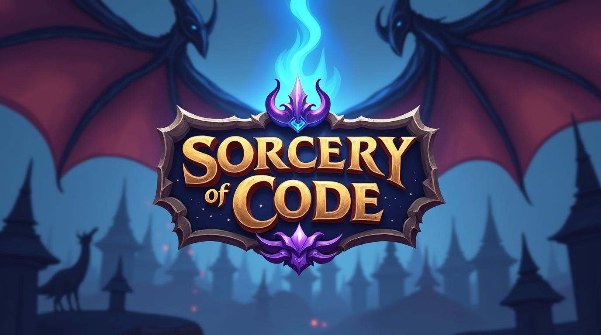

# Sorcery of Code

Learn Python, machine learning, and AI through hands-on coding challenges.

## About This Project

This project helps you learn to code through challenges that get harder as you progress!

Complete each task to unlock new lessons. Track your progress with badges and leaderboards.

## My Inspiration

I created this project because I wanted:
- A fun, game-based way to learn coding
- A clear path from Python basics to advanced AI
- To document my learning journey
- To be more active on GitHub

## What You'll Learn

- **Module 0:** Python basics
- **Module 1:** Better Python skills and best practices
- **Module 2:** Machine learning fundamentals
- **Module 3:** Building AI applications
- **Module 4:** Final project to show what you've learned

## How to Start

1. Fork or clone this repository
2. Start with Module 0
3. Complete the challenges
4. Submit your solutions as pull requests
5. Pass the tests to unlock next lessons

## Help Improve

Found a bug or have ideas? Please:
- Open an issue
- Submit a fix
- Share your feedback

## License

[MIT License](LICENSE)

---

*Learning step by step builds lasting skills.*
